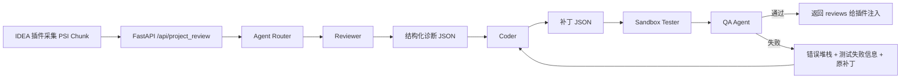

# Agent-Review 多智能体架构升级说明

## 1. 升级目标

本次升级将原有的单智能体代码审查流程拆分为异构多智能体协同工作流：

- Reviewer：根据项目代码、IDEA PSI 语义切块结果和标准库 RAG 召回内容定位缺陷，并从白盒测试视角设计测试用例，验证 AI 生成补丁是否覆盖需求、边界条件和回归风险。
- Coder：根据 Reviewer 的结构化诊断报告生成最小可注入补丁。
- Sandbox Tester：将补丁应用到临时沙箱目录中，运行受控的语法、编译和测试检查，避免污染真实工作区。
- QA Agent：结合补丁静态校验和沙箱测试结果评估补丁质量；发现问题后将错误堆栈、测试失败信息和原补丁回传给 Coder 迭代修复。

后端仍暴露 `POST /api/project_review`，插件端不需要改变用户交互方式。多智能体编排层已改为使用开源框架 LangGraph 实现。

## 2. 当前实现涉及的技术与框架

- IntelliJ Platform SDK：插件端使用 `AnAction`、`ToolWindow`、`Document`、`VirtualFile`、`WriteCommandAction`、`RangeMarker` 完成代码采集、补丁注入和局部撤销。
- PSI：插件端通过 `PsiDocumentManager`、`PsiFile`、`PsiClass`、`PsiMethod` 解析 Java 文件结构，生成类/方法级语义 Chunk。
- FastAPI：Python 后端提供本地 HTTP 服务。
- LangGraph：使用 `StateGraph` 搭建 Reviewer、Coder、Sandbox Tester、QA Agent 的多智能体工作流，并通过条件边实现 QA 失败后的自动纠错循环。
- Pydantic：定义文件输入、Reviewer Finding、Coder Patch、QA Result 等结构化数据模型。
- OpenAI 兼容 SDK：同时支持 DashScope/Qwen 兼容接口和 OpenAI 兼容接口。
- Gson：插件端序列化文件内容、语言、语义 Chunk 后发送给后端。
- javac / Python AST：Sandbox Tester 和 QA Agent 对 Java 类级补丁和 Python 补丁做本地语法校验；同时对所有语言做括号、字符串闭合检查。

## 3. IDEA 端语义级切块设计

插件端在 `AgentReviewAction` 中采集代码时，不再只发送完整文件文本，而是附带：

- `language`：根据扩展名识别语言。
- `chunks`：语义 Chunk 数组。
- `chunk_id`：文件路径、语义类型和 offset 组成的唯一标识。
- `kind`：`class`、`method`、`selection`、`text_window` 等。
- `start_line` / `end_line`：Chunk 在原文件中的行号。
- `estimated_tokens`：基于字符长度和非 ASCII 字符估算的 Token 消耗。
- `text`：Chunk 内容。

Java 文件优先按 PSI 的类和方法切块。超过 `MAX_CHUNK_TOKENS` 的大块会继续按行窗口切分，避免单个 Chunk 吞掉过多上下文窗口。非 Java 文件当前使用窗口切分，后续可继续扩展 Kotlin、Python、TypeScript 的 PSI/UAST 解析。

## 4. 多智能体协同流程

后端在 `agent.py` 中通过 `build_review_graph()` 定义 LangGraph 工作流：

- `route_node`：根据任务复杂度选择模型。
- `reviewer_node`：调用 Reviewer 生成结构化缺陷诊断和白盒测试计划。
- `coder_node`：调用 Coder 生成补丁；如果存在 QA 反馈，则带着错误堆栈和原补丁重新生成。
- `sandbox_test_node`：把补丁应用到临时目录中，运行受控的沙箱测试和编译检查。
- `qa_node`：结合补丁静态校验、Reviewer 白盒测试计划和沙箱测试结果判断补丁质量。
- `after_reviewer`：如果没有发现缺陷，直接结束工作流。
- `after_qa`：如果 QA 通过，结束；如果失败且未超过最大修复轮次，回到 Coder。



Reviewer 输出严格 JSON 数组，字段包括：

- `finding_id`
- `file_path`
- `target_snippet`
- `severity`
- `dimensions`
- `diagnosis`
- `evidence`
- `standard_library_refs`
- `white_box_tests`

Coder 输出严格 JSON 数组，字段包括：

- `file_path`
- `target_snippet`
- `replacement_code`
- `explanation`
- `finding_id`

插件端沿用原有 `target_snippet` 精确替换策略，并使用 `RangeMarker` 注册每个补丁的独立 Undo 操作。

## 5. RAG 标准库接入方案

当前项目还没有标准库，因此代码中预留了 `standard_library_hits` 字段。后续建议按以下方式建设：

1. 标准库内容来源
   - 公司架构规范、接口设计规范、安全编码规范。
   - 历史缺陷及修复样例。
   - 优秀项目代码片段。
   - 框架最佳实践，例如 Spring Controller、Service、DAO 分层约束。

2. 标准库切分
   - 文档规范按章节切分。
   - 代码样例按类、方法、接口契约切分。
   - 每条记录保留 `rule_id`、`title`、`dimension`、`language`、`framework`、`content`、`bad_example`、`good_example`、`fix_pattern`。

3. 向量化与索引
   - 使用通用 Embedding 模型对标准库 Chunk 建向量。
   - 可选向量库：FAISS、Milvus、Qdrant、Elasticsearch Dense Vector。
   - 元数据过滤优先按语言、框架、文件类型、审查维度筛选，再做向量相似度召回。

4. 审查时召回
   - 以当前代码 Chunk、文件路径、类名、方法名、依赖接口名作为查询。
   - TopK 召回标准库规则和相似修复样例。
   - 将召回结果填入 `/api/project_review` 的 `standard_library_hits`。
   - Reviewer 必须把命中的规则写入 `standard_library_refs`，从而使审查结论可追溯。

5. 与三大审查维度结合
   - 架构规范依从性：召回分层、依赖方向、命名、异常处理、日志规范。
   - 跨文件接口一致性：召回接口契约、DTO 字段约束、调用方/被调用方约定。
   - 潜在逻辑漏洞：召回历史缺陷、边界条件、权限校验、空值处理、安全规则。

## 6. 模型微调建议

微调目标不是让模型记住整个项目，而是让它稳定遵守审查流程、输出 JSON、识别项目特有缺陷模式。

建议数据集格式：

- 输入：代码 Chunk、相关标准库召回、项目元数据。
- 输出一：Reviewer Finding JSON。
- 输出二：Coder Patch JSON。
- 输出三：QA 失败后的二次修复 JSON。

样本来源：

- 历史 Review 记录：缺陷描述、原代码、修复代码。
- 人工构造的反例/正例：接口不一致、架构越层调用、未鉴权、空指针、事务边界错误。
- QA 失败样本：截断补丁、括号未闭合、字符串未闭合、缺少 import 等。

训练策略：

- 先做 SFT，让模型学会固定 JSON Schema 和角色边界。
- 再做偏好优化，偏好最小补丁、精确 `target_snippet`、可解释诊断。
- 对便宜模型可做 LoRA/QLoRA 轻量微调，用于 Reviewer 初筛和简单修复。
- 对强模型通常不必全量微调，优先使用高质量 few-shot、JSON Schema、RAG 约束和评测集回归。

评测指标：

- JSON 可解析率。
- `target_snippet` 命中率。
- 补丁语法通过率。
- 缺陷召回率与误报率。
- 与标准库规则的引用准确率。
- 多轮自我纠错收敛率。

## 7. Agent 路由策略

后端 `ModelRouter` 会根据任务复杂度选择模型：

- 简单任务：单文件、小上下文、非补丁类任务，路由到 `CHEAP_MODEL`，默认 `qwen3.5`。
- 复杂任务：多文件、大上下文、代码审查/补丁生成任务，Reviewer 默认使用 `REVIEW_MODEL`，Coder 默认使用 `CODER_MODEL`。
- QA Agent：默认使用便宜模型或本地静态校验，因为它主要负责格式和语法约束。

可通过环境变量配置：

```bash
DASHSCOPE_API_KEY=...
OPENAI_API_KEY=...
CHEAP_MODEL=qwen3.5
REVIEW_MODEL=qwen-plus
CODER_MODEL=gpt-5.5
MAX_REPAIR_ROUNDS=2
```

如果当前环境没有 OpenAI Key，但 `CODER_MODEL` 指向 `gpt-5.5`，复杂任务会提示缺少 `OPENAI_API_KEY`。可以临时把 `CODER_MODEL` 改成 DashScope 支持的强模型，例如 `qwen-max`。

## 8. 后续扩展建议

- 增加独立 `/api/retrieve_standard_library`，由后端根据 Chunk 自动完成 RAG 召回。
- 为 Kotlin、Python、TypeScript 接入 UAST 或 Tree-sitter，补齐多语言语义切块。
- 用 JSON Schema 或 Pydantic validation error 直接回传给 Coder，进一步提升结构化输出稳定性。
- 将 QA 从补丁片段校验升级为“应用补丁到临时工作树后运行 Gradle/Maven/pytest”的项目级校验。
- 为每个 Agent 增加 trace id、模型名、耗时、Token 统计，便于审计和成本治理。
