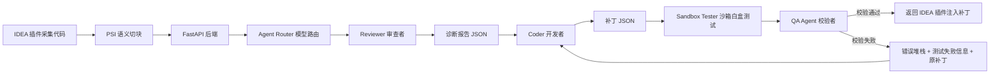

# 多智能体代码审查系统说明文档

## 1. 项目升级背景

原项目采用单智能体架构：IDEA 插件端采集代码后，将代码直接发送给 Python 后端，由一个大模型完成代码审查和修复建议生成。这种方式实现简单，但存在以下问题：

- 审查、修复、校验职责混在一起，难以稳定控制输出质量。
- 大模型直接生成补丁时，容易出现 JSON 格式不稳定、代码截断、括号未闭合等问题。
- 缺少标准库或规范库对比机制，审查结果主要依赖模型通用知识。
- 对简单任务和复杂任务没有模型路由，成本和效果难以兼顾。

本次升级将项目改造成“审查者-开发者-校验者”的多智能体协同架构，让不同 Agent 承担不同职责，并引入自我纠错机制和模型路由能力。

## 2. 总体架构

系统由 IDEA 插件端和 Python 后端组成。

IDEA 插件端负责：

- 采集用户选中的文件、目录或代码片段。
- 使用 IntelliJ PSI 对代码进行语义级切块。
- 将文件路径、语言、代码内容、Chunk 元数据发送给后端。
- 接收后端生成的补丁结果。
- 使用 `WriteCommandAction` 将补丁注入到编辑器。
- 使用 `RangeMarker` 支持局部撤销。

Python 后端负责：

- 接收插件端传来的项目上下文。
- 根据任务复杂度选择合适模型。
- 调度 Reviewer、Coder、QA Agent。
- 输出结构化 JSON 修复方案。
- 在 QA 失败时自动把错误信息和原补丁回传给 Coder 进行迭代修复。

## 2.1 智能体开发框架与实现方式

本项目的智能体部分已经改造为基于 LangGraph 的开源多智能体工作流。LangGraph 负责描述 Reviewer、Coder、QA Agent 之间的节点关系、条件跳转和自我纠错循环；FastAPI 负责对 IDEA 插件暴露 HTTP 接口；Pydantic 负责定义输入输出结构。

核心技术组合如下：

- LangGraph：作为多智能体工作流编排框架，用 `StateGraph` 定义 `route -> reviewer -> coder -> qa` 的执行图，并通过条件边实现 QA 失败后回到 Coder 重新修复。
- FastAPI：作为智能体后端服务框架，对 IDEA 插件暴露 `/api/project_review` 接口。
- Pydantic：定义智能体之间传递的数据结构，例如 `ReviewFinding`、`PatchItem`、`QaResult`，保证 Agent 输出可以被稳定解析。
- OpenAI Python SDK 兼容接口：统一调用 Qwen、GPT 等大模型。DashScope 的 Qwen 接口使用 OpenAI compatible mode，GPT-5.5 使用 OpenAI 兼容接口。
- LangGraph State：使用 `AgentWorkflowState` 保存请求、任务复杂度、Reviewer 诊断结果、Coder 补丁、QA 校验结果、修复轮次和模型路由信息。
- 自定义 ModelRouter：根据任务复杂度选择便宜模型或强模型。
- 本地静态校验工具：QA Agent 使用 Python AST、括号闭合检查、可选 `javac` 编译检查来验证补丁质量。

选择 LangGraph 的原因：

- LangGraph 用图结构表达多 Agent 协作，比简单顺序调用更清晰。
- 条件边天然适合实现 QA 失败后的“错误堆栈 + 原补丁”回传机制。
- StateGraph 可以显式保存每个 Agent 的中间结果，便于后续增加日志追踪、可视化和断点恢复。
- 相比 AutoGen、CrewAI 这类更偏对话协作的框架，LangGraph 更适合本项目这种确定性较强的工程流水线。
- 后续可以继续扩展 RAG 检索节点、人工确认节点、项目级构建校验节点，而不破坏现有接口。

代码中对应关系：

- `reviewer_agent()`：Reviewer 审查者。
- `coder_agent()`：Coder 开发者。
- `qa_agent()`：QA Agent 校验者。
- `ModelRouter`：模型路由器。
- `build_review_graph()`：LangGraph 工作流定义。
- `route_node()`：模型路由节点。
- `reviewer_node()`：Reviewer 节点。
- `coder_node()`：Coder 节点。
- `sandbox_test_node()`：沙箱测试节点，负责在临时目录中应用补丁并运行受控测试/编译检查。
- `qa_node()`：QA 校验节点，负责结合补丁静态校验、Reviewer 白盒测试计划和沙箱测试结果判断补丁质量。
- `after_reviewer()`：Reviewer 后置条件边，没有缺陷则直接结束。
- `after_qa()`：QA 后置条件边，通过则结束，失败且未超过最大修复轮次则回到 Coder。
- `/api/project_review`：多智能体工作流入口。

整体流程如下：



## 3. 三类 Agent 职责

### 3.1 Reviewer 审查者

Reviewer 负责缺陷定位，不直接写代码补丁。

主要职责：

- 基于当前代码和标准库召回结果进行对比。
- 从架构规范依从性、跨文件接口一致性、潜在逻辑漏洞三个维度审查代码。
- 输出结构化诊断 JSON。
- 精确定位需要修改的 `target_snippet`。

Reviewer 输出字段：

```json
[
  {
    "finding_id": "R001",
    "file_path": "文件绝对路径",
    "target_snippet": "需要被替换的原始代码片段",
    "severity": "high",
    "dimensions": ["architecture", "interface_consistency", "logic_bug"],
    "diagnosis": "问题说明",
    "evidence": ["证据说明"],
    "standard_library_refs": ["标准库规则 ID"]
  }
]
```

### 3.2 Coder 开发者

Coder 负责根据 Reviewer 的诊断报告生成补丁。

主要职责：

- 读取 Reviewer 输出的 Finding。
- 生成最小化、可注入的修复代码。
- 保持 `target_snippet` 与原文件内容精确匹配。
- 输出后续插件端可稳定解析的 JSON。

Coder 输出字段：

```json
[
  {
    "file_path": "文件绝对路径",
    "target_snippet": "需要被替换的原始代码片段",
    "replacement_code": "修复后的代码",
    "explanation": "修复原因",
    "finding_id": "R001"
  }
]
```

### 3.3 QA Agent 校验者

QA Agent 负责补丁质量校验。

当前实现包括：

- 通用括号闭合检查：`()`, `[]`, `{}`。
- 字符串闭合检查。
- Python 代码使用 `ast.parse` 做语法校验。
- Java 类级代码在本机有 `javac` 时尝试编译校验。

如果 QA 发现问题，例如补丁截断、括号未闭合、字符串未闭合、Java/Python 语法错误，系统会将：

- QA 错误信息
- 原始补丁
- 对应 Finding

重新发送给 Coder，要求 Coder 生成修正版补丁。

## 4. IDEA 插件端 PSI 语义切块

## 3.4 面向 AI Coding 的白盒测试审查机制

在实际 AI Coding 场景中，AI 生成的代码通常很少出现低级语法错误，真正需要重点验证的是：补丁是否满足需求、是否覆盖边界条件、是否引入回归、是否破坏跨文件接口约定。因此本项目将 Reviewer 的职责从“只定位缺陷”扩展为“缺陷定位 + 白盒测试设计”。

Reviewer 现在需要输出 `white_box_tests` 字段。每个测试用例描述测试目标、输入条件、预期结果和覆盖的风险点，例如：

```json
{
  "test_id": "R001-T1",
  "purpose": "验证未授权用户无法访问敏感接口",
  "input": "未登录用户调用 getUserInfo",
  "expected": "系统拒绝访问并返回权限错误",
  "covers": ["security", "regression", "interface_contract"]
}
```

Coder 生成补丁后，系统不会直接把补丁交给 QA，而是先进入 `sandbox_test_node`：

- 在临时目录中复制插件端传来的文件。
- 在沙箱副本中应用 `target_snippet + replacement_code` 补丁。
- 运行受控的语法、编译和测试检查。
- 收集 Reviewer 设计的白盒测试计划。
- 将沙箱执行结果和白盒测试计划一起传给 QA Agent。

当前沙箱采用临时目录隔离，避免污染真实项目文件。为了安全，系统不会执行模型任意生成的 shell 命令，只运行后端预置的 allowlist 检查，例如 Python AST、`python -m py_compile`、Java `javac`。后续可以把 Maven、Gradle、pytest、JUnit 等项目级测试命令加入白名单。

QA Agent 的职责也随之变化：它不再只是判断补丁有没有语法错误，而是结合补丁静态校验、沙箱执行结果和 Reviewer 白盒测试计划，判断补丁质量是否可靠。如果测试失败，QA 会把失败信息、原补丁和测试计划一起回传给 Coder 进行下一轮修复。

原项目主要上传完整文件内容。本次升级后，插件端会额外上传 `chunks` 字段。

Chunk 示例：

```json
{
  "chunk_id": "UserService.java:method:120-380",
  "kind": "method",
  "start_line": 12,
  "end_line": 30,
  "estimated_tokens": 520,
  "text": "方法级代码内容"
}
```

当前 Java 文件切块策略：

- 优先使用 PSI 提取 `PsiClass`。
- 再提取 `PsiMethod`。
- 如果单个类或方法超过 token 预算，则按行窗口继续切分。
- 如果 PSI 不可用，则回退为普通文本窗口切分。

Token 控制策略：

- 插件端通过 `estimateTokens` 粗略估算 token。
- 默认单个 Chunk 预算为 `MAX_CHUNK_TOKENS = 1800`。
- 目的是避免单次 prompt 过大，同时尽量保留类、方法级上下文完整性。

## 5. 标准库 RAG 接入方案

当前项目还没有标准库，但后端已经预留了 `standard_library_hits` 字段，可以用于接入 RAG 召回结果。

### 5.1 标准库内容来源

建议标准库包含：

- 公司编码规范。
- 架构分层规范。
- 安全编码规范。
- 历史缺陷案例。
- 历史优秀修复样例。
- 框架最佳实践。
- 接口契约说明。

### 5.2 标准库数据结构

建议每条标准库记录包含：

```json
{
  "rule_id": "ARCH-001",
  "title": "Controller 不应直接访问 DAO",
  "dimension": "architecture",
  "language": "java",
  "framework": "spring",
  "content": "规则正文",
  "bad_example": "错误示例",
  "good_example": "正确示例",
  "fix_pattern": "修复模式"
}
```

### 5.3 RAG 检索流程

推荐流程：

1. 对标准库内容切分 Chunk。
2. 使用 Embedding 模型生成向量。
3. 存入向量库。
4. 审查时用当前代码 Chunk、类名、方法名、接口名作为查询。
5. 先按语言、框架、审查维度过滤。
6. 再按向量相似度召回 TopK 标准库片段。
7. 将召回结果传入 `standard_library_hits`。
8. Reviewer 基于标准库内容与当前代码做对比审查。

可选向量库：

- FAISS：适合本地轻量原型。
- Milvus：适合企业级大规模向量检索。
- Qdrant：部署简单，过滤能力较好。
- Elasticsearch Dense Vector：适合已有 ES 技术栈的团队。

## 6. 大模型微调方案

微调目标不是让模型记住所有业务代码，而是让模型更稳定地完成以下任务：

- 按固定 JSON Schema 输出。
- 精确定位 `target_snippet`。
- 根据标准库规则判断代码是否违规。
- 生成最小补丁。
- 修复 QA 反馈的语法错误或截断问题。

### 6.1 数据集构造

训练样本建议包括：

- 输入代码 Chunk。
- 标准库召回结果。
- 人工标注的缺陷诊断。
- 修复前代码。
- 修复后代码。
- QA 失败补丁与修正补丁。

训练样本格式可以设计为：

```json
{
  "input": {
    "role": "reviewer",
    "code_chunk": "待审查代码",
    "standard_library_hits": ["召回规则"]
  },
  "output": [
    {
      "finding_id": "R001",
      "file_path": "...",
      "target_snippet": "...",
      "diagnosis": "..."
    }
  ]
}
```

### 6.2 微调策略

推荐分阶段进行：

- 第一阶段：SFT 监督微调，让模型学会角色职责和 JSON 输出格式。
- 第二阶段：加入历史缺陷和修复样例，让模型贴合项目审查标准。
- 第三阶段：加入 QA 失败样本，提升模型修复截断、括号未闭合、语法错误的能力。
- 第四阶段：使用评测集回归，持续评估 JSON 可解析率、补丁命中率、语法通过率。

对于便宜模型，例如 Qwen 系列，可使用 LoRA/QLoRA 做轻量微调。对于能力较强的模型，例如 GPT-5.5，优先使用 Prompt Engineering、RAG 和少样本示例约束，通常不需要项目级全量微调。

## 7. Agent 模型路由

后端实现了 `ModelRouter`，根据任务复杂度选择模型。

默认策略：

- 简单任务：调用便宜模型，例如 `qwen3.5`。
- 复杂任务：Reviewer 使用较强审查模型，例如 `qwen-plus`。
- 代码修复任务：Coder 使用更强模型，例如 `gpt-5.5`。
- QA Agent：优先使用本地静态校验和便宜模型。

可通过环境变量配置：

```bash
DASHSCOPE_API_KEY=你的 DashScope Key
OPENAI_API_KEY=你的 OpenAI Key
CHEAP_MODEL=qwen3.5
REVIEW_MODEL=qwen-plus
CODER_MODEL=gpt-5.5
MAX_REPAIR_ROUNDS=2
```

如果当前没有 OpenAI Key，也可以将：

```bash
CODER_MODEL=qwen-max
```

这样复杂修复任务会走 DashScope 兼容接口。

## 8. 当前修改的核心文件

本次主要修改和新增文件：

- `agent.py`：后端多智能体编排、模型路由、QA 校验、自我纠错。
- `Agent-review/src/main/java/com/work/agentreview/AgentReviewAction.java`：IDEA 插件端 PSI 语义切块、token 估算、Chunk 元数据上报。
- `test_agent.py`：后端接口测试脚本，适配新的 `/api/project_review` 协议。
- `MULTI_AGENT_ARCHITECTURE.md`：技术架构说明。
- `多智能体代码审查系统说明文档.md`：当前文档。

## 9. 后续可继续增强的方向

- 新增独立 RAG 服务接口，由后端自动从标准库召回规则。
- 对 Kotlin、Python、TypeScript 接入更细粒度 AST 或 Tree-sitter 切块。
- 使用 JSON Schema 强约束模型输出。
- 将 QA 从片段级校验升级为应用补丁后的项目级构建校验。
- 增加 Agent Trace，包括模型名、耗时、token 消耗、失败原因。
- 增加人工确认模式，让用户选择是否应用补丁，而不是直接注入。

## 10. 总结

升级后的系统从单智能体变为多智能体协同架构，形成了“审查-修复-校验-纠错”的闭环。

Reviewer 专注缺陷定位，Coder 专注生成补丁，QA Agent 专注质量校验。IDEA 插件端通过 PSI 实现语义级切块，后端通过模型路由在成本和效果之间做平衡。后续引入标准库 RAG 后，系统可以从通用代码审查进一步升级为贴合企业规范和项目历史经验的智能代码审查平台。
