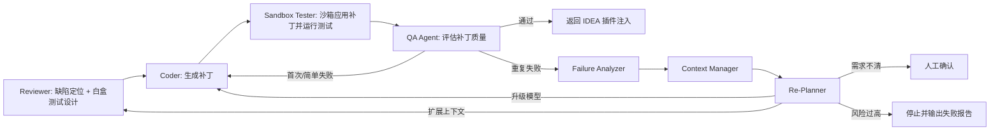

# 多轮修复失败优化方案

## 1. 问题背景

在实际 AI Coding 场景中，复杂问题可能出现以下情况：

- 模型连续几轮都没有修对。
- 每次补丁都能通过语法检查，但业务行为仍然错误。
- Coder 根据错误日志局部修补，导致问题越来越偏。
- QA 只反馈失败结果，没有帮助模型定位真正根因。
- 同一个模型反复使用同一种错误思路，陷入局部最优。

因此，系统不能只做简单的“QA 失败 -> 回到 Coder -> 再试一次”。当多轮失败发生时，需要进入更稳健的失败收敛机制。

## 2. 核心优化思路

多轮修复失败时，不应该继续盲目重试，而应该切换为“复盘-重诊断-重规划-受控修复”的流程。

推荐将当前工作流从：

```text
Reviewer -> Coder -> Sandbox Tester -> QA -> Coder
```

扩展为：

```text
Reviewer -> Coder -> Sandbox Tester -> QA
                         |
                         v
                  Failure Analyzer
                         |
                         v
                  Re-Planner / Escalation
                         |
                         v
                      Coder
```

新增两个关键节点：

- Failure Analyzer：分析多轮失败原因，判断是需求理解错误、定位错误、测试不足、上下文不足还是模型能力不足。
- Re-Planner：重新生成修复计划，必要时升级模型、扩大上下文、切换策略或请求人工确认。

## 3. 失败类型分类

系统应当对失败进行分类，而不是只记录“测试失败”。

### 3.1 语法类失败

表现：

- 括号未闭合。
- 字符串未闭合。
- Python AST 解析失败。
- Java 编译失败。

处理方式：

- 直接回传给 Coder。
- 限制 Coder 只修复语法问题。
- 不允许改变业务逻辑。

### 3.2 目标片段匹配失败

表现：

- `target_snippet` 在原文件中找不到。
- 补丁应用不到沙箱。

处理方式：

- 让 Coder 缩小 `target_snippet`。
- 增加行号、类名、方法名等定位信息。
- 后续可用 PSI 节点定位替代纯字符串定位。

### 3.3 测试行为失败

表现：

- 补丁语法正确，但白盒测试不通过。
- 修复了正常路径，边界条件仍失败。
- 修复当前问题，引入回归。

处理方式：

- 进入 Failure Analyzer。
- 比较 Reviewer 测试计划和实际失败结果。
- 要求 Coder 先解释失败原因，再生成补丁。

### 3.4 需求理解失败

表现：

- 模型一直在修错误位置。
- 补丁方向和需求不一致。
- 多轮修改都没有靠近正确行为。

处理方式：

- 重新触发 Reviewer。
- 扩大上下文。
- 引入标准库 RAG 或历史案例。
- 必要时请求人工确认需求。

### 3.5 上下文不足

表现：

- 单文件修复无法解决问题。
- 跨文件接口、配置、依赖关系缺失。
- 模型猜测外部函数行为。

处理方式：

- 触发上下文扩展。
- 检索调用方、被调用方、接口定义、配置文件、测试文件。
- 重新进行 Reviewer 诊断。

### 3.6 模型能力不足

表现：

- 多轮失败原因不同。
- 输出看似合理但始终不能通过关键测试。
- 复杂重构、算法修复、跨模块修改超出当前模型能力。

处理方式：

- 升级模型。
- 从便宜模型切到强模型。
- 降低温度。
- 要求模型先写修复计划，再写补丁。

### 3.7 多轮上下文过长导致能力退化

表现：

- 对话轮次越多，模型越容易忽略最初需求。
- 后续补丁开始违反前几轮已经确认的约束。
- 模型反复引用过时补丁或已经被否定的修复方向。
- Prompt 中堆积大量历史日志、代码、失败信息，关键测试反而被淹没。
- 模型回答变得泛化，缺少对当前失败点的精确引用。

这类问题不是简单的“上下文不足”，而是“上下文过载”。上下文太长会导致模型注意力分散，尤其在多轮修复中，历史补丁、旧错误、当前错误、测试计划和代码片段混在一起，模型很容易抓错重点。

处理方式：

- 不把完整对话历史原样传给 Coder。
- 对历史轮次做结构化压缩。
- 只保留当前决策所需的最小上下文。
- 将不可违反的需求、接口约束、测试目标放入高优先级约束区。
- 将过时补丁和已经失败的思路标记为 negative memory，禁止模型重复。
- 超过上下文阈值时触发 Context Manager 节点重写上下文。

## 4. 增加 Failure Analyzer 节点

Failure Analyzer 的职责是分析失败收敛方向。

输入：

- Reviewer 原始诊断。
- Reviewer 白盒测试计划。
- Coder 历史补丁。
- Sandbox Tester 每轮测试结果。
- QA 每轮反馈。
- 当前文件上下文。

输出：

```json
{
  "failure_type": "behavior_test_failed",
  "root_cause_hypothesis": "补丁只处理了空值路径，但没有处理权限校验路径",
  "is_same_error_repeated": true,
  "needs_more_context": false,
  "needs_model_escalation": true,
  "needs_human_confirmation": false,
  "next_strategy": "generate_test_driven_patch",
  "constraints_for_next_coder": [
    "不要修改 public API",
    "必须满足 R001-T1 和 R001-T2",
    "先解释失败原因，再给 replacement_code"
  ]
}
```

这个节点的重点不是再生成补丁，而是阻止系统无意义重试。

## 5. 增加 Re-Planner 节点

Re-Planner 根据 Failure Analyzer 的结论重新规划下一步。

可选动作：

- `retry_same_model`：简单语法错误，可继续使用当前模型。
- `escalate_model`：切换到更强模型，例如从 Qwen 切到 GPT-5.5。
- `expand_context`：追加调用链、接口定义、测试文件、配置文件。
- `rerun_reviewer`：重新诊断，避免沿着错误方向继续修。
- `ask_human`：需求不清或风险过高时请求人工确认。
- `stop_and_report`：超过风险阈值时停止自动修改，只输出分析报告。

## 6. 引入测试驱动修复模式

当多轮失败是行为测试失败时，应切换为测试驱动修复模式。

要求 Coder 先输出：

1. 失败测试对应的业务行为。
2. 当前代码为什么失败。
3. 修复策略。
4. 最小补丁。

Prompt 约束示例：

```text
你不能直接生成补丁。请先解释每个失败测试为什么失败，
然后给出满足这些测试的最小修改。
不得修改与失败测试无关的代码。
不得改变 public API。
```

这样可以减少模型“乱试补丁”的概率。

## 7. 引入补丁历史对比

系统应保存每一轮补丁历史：

- 修改了哪些文件。
- 修改了哪些代码片段。
- 哪些测试通过。
- 哪些测试失败。
- 是否重复修改同一区域。

如果发现模型连续多轮修改同一区域但测试不变，应判定为“重复失败”，触发策略升级。

判断条件示例：

```text
same_failure_count >= 2
or
same_target_snippet_modified >= 2
or
qa_failures_semantically_same >= 2
```

触发后不再直接回到 Coder，而是进入 Failure Analyzer。

## 8. 上下文扩展策略

复杂问题常常不是当前文件能解决的。上下文扩展可以按优先级进行：

1. 当前方法所在类。
2. 调用当前方法的文件。
3. 当前方法调用的下游方法。
4. 接口定义和实现类。
5. DTO、配置文件、路由文件。
6. 已有测试文件。
7. 标准库 RAG 召回规则。

IDEA 插件端后续可以利用 PSI 和索引能力实现：

- 查找引用。
- 查找实现。
- 查找继承关系。
- 查找同名测试类。
- 查找接口契约。

## 8.1 上下文过载优化策略

多轮对话不应该简单地把所有历史消息继续塞进 prompt。更好的做法是引入 Context Manager 节点，对历史信息进行分层压缩和重组。

### 8.1.1 上下文分层

建议把上下文拆成四层：

1. Hard Constraints
   - 不可违反的需求。
   - public API 约束。
   - 标准库强制规则。
   - 必须通过的白盒测试。

2. Current Working Set
   - 当前相关代码 Chunk。
   - 当前失败测试。
   - 当前补丁目标文件。
   - 当前 Reviewer 诊断。

3. Attempt Summary
   - 历史尝试的摘要。
   - 每轮改了什么。
   - 每轮为什么失败。

4. Negative Memory
   - 已经证明错误的修复方向。
   - 不能重复的补丁模式。
   - 被 QA 或人工否定的假设。

Coder 下一轮修复时，应优先读取前两层。历史尝试只能以摘要形式出现，不能把完整旧补丁和旧日志全部塞进去。

### 8.1.2 上下文压缩格式

当多轮失败后，Context Manager 可以把历史压缩成如下结构：

```json
{
  "hard_constraints": [
    "不得修改 public API",
    "必须通过 R001-T1: 未授权访问应返回 401",
    "必须保持 UserService.getUserInfo 返回类型不变"
  ],
  "current_failure": {
    "test_id": "R001-T1",
    "failure": "未授权用户仍然可以访问用户信息",
    "relevant_file": "UserController.java",
    "relevant_method": "getUserInfo"
  },
  "attempt_summary": [
    {
      "round": 1,
      "change": "增加空值判断",
      "result": "权限测试仍失败",
      "lesson": "问题不是空值，而是缺少权限校验"
    },
    {
      "round": 2,
      "change": "修改返回空对象",
      "result": "破坏接口契约",
      "lesson": "不能改变返回语义"
    }
  ],
  "negative_memory": [
    "不要再只增加 null check",
    "不要通过返回空对象规避权限问题",
    "不要修改 getUserInfo 的方法签名"
  ]
}
```

### 8.1.3 关键约束钉扎

为了防止长上下文中关键约束被模型忽略，应将重要信息固定放在 Prompt 前部或单独的 system/developer 约束区。

需要钉扎的信息：

- 当前必须通过的测试。
- 不允许修改的接口。
- 已失败的修复方向。
- 标准库强制规则。
- 用户明确表达的需求。

Prompt 中可以加入：

```text
以下约束优先级最高，任何补丁不得违反：
1. 不得修改 public API。
2. 必须通过 R001-T1 和 R001-T2。
3. 不得重复使用 negative_memory 中的修复方向。
4. 只修改当前 target file 中与失败测试直接相关的代码。
```

### 8.1.4 历史信息淘汰

不是所有历史都值得保留。

应该淘汰：

- 旧的完整补丁代码。
- 已经被新失败覆盖的旧错误日志。
- 与当前失败测试无关的解释。
- 重复的模型自然语言分析。

应该保留：

- 每轮失败的结论。
- 已经证明错误的修复方向。
- 仍然有效的约束。
- 当前失败测试和相关代码。

## 8.2 增加 Context Manager 节点

推荐在 LangGraph 中增加 `context_manager_node`。

触发条件：

- 对话轮次超过 2 轮。
- prompt 估算 token 超过阈值。
- 同一测试连续失败。
- 模型开始违反历史约束。
- Failure Analyzer 判断为上下文过载。

输入：

- 原始需求。
- Reviewer 诊断。
- 白盒测试计划。
- 每轮补丁摘要。
- 每轮 QA 和沙箱结果。
- 标准库 RAG 召回。

输出：

```json
{
  "compressed_context": {
    "hard_constraints": [],
    "current_working_set": {},
    "attempt_summary": [],
    "negative_memory": []
  },
  "dropped_context": [
    "round_1_full_patch",
    "obsolete_stack_trace"
  ],
  "reason": "上下文过长，保留约束和失败摘要，丢弃旧补丁全文"
}
```

新的工作流可以变成：

```text
QA Failed -> Failure Analyzer -> Context Manager -> Re-Planner -> Coder
```

这样可以避免模型在过长历史中迷路。

## 9. 模型升级策略

多轮失败不一定是代码难，也可能是模型能力不足。

建议路由规则：

- 第 1 轮：按普通复杂度选择模型。
- 第 2 轮失败：降低 temperature，要求测试驱动修复。
- 第 3 轮失败：升级到强模型。
- 第 4 轮失败：扩大上下文并重新 Reviewer。
- 第 5 轮失败：停止自动修复，输出人工接管报告。

示例：

```text
qwen3.5 -> qwen-plus -> qwen-max -> gpt-5.5
```

对于高风险补丁，不应无限重试。

## 10. 人工介入机制

当系统判断继续自动修复风险较高时，应请求人工确认。

典型触发条件：

- 需求不明确。
- 多轮失败。
- 需要修改公共接口。
- 需要跨多个模块重构。
- 测试结果互相矛盾。
- 标准库规则和当前代码冲突。

人工确认问题应尽量具体，例如：

```text
当前失败原因可能是权限策略不明确：
未登录用户访问 getUserInfo 时，应该返回 401 还是空对象？
```

不要泛泛地问“是否继续修复”。

## 11. 回滚和安全保护

复杂问题多轮修复时，必须避免越改越乱。

建议保护机制：

- 每轮补丁只在沙箱中应用。
- 真实 IDE 文件只应用最终 QA 通过的补丁。
- 每个补丁保持 RangeMarker 局部撤销。
- 多轮失败后丢弃候选补丁。
- 输出失败报告，而不是强行注入。

## 12. 推荐的 LangGraph 新工作流



## 13. 失败报告格式

当系统停止自动修复时，应输出结构化失败报告：

```json
{
  "status": "needs_human_review",
  "reason": "多轮补丁均未通过白盒测试",
  "failed_rounds": 3,
  "most_likely_root_cause": "缺少跨文件权限策略上下文",
  "context_health": {
    "status": "overloaded",
    "reason": "历史补丁和旧错误日志过多，模型开始忽略权限测试约束"
  },
  "attempted_patches_summary": [
    "第 1 轮增加空值判断，但权限测试失败",
    "第 2 轮修改返回值，但破坏接口契约",
    "第 3 轮增加权限判断，但缺少调用方上下文"
  ],
  "recommended_next_action": "补充权限策略标准库或提供 UserService 调用链上下文",
  "questions_for_human": [
    "未授权访问应返回异常还是空结果？",
    "该接口是否必须保持当前返回类型？"
  ]
}
```

## 14. 当前项目可以如何落地

短期可做：

- 在 `AgentWorkflowState` 中增加 `attempt_history`。
- 在 `AgentWorkflowState` 中增加 `compressed_context` 和 `negative_memory`。
- QA 连续失败两次后进入 `failure_analyzer_node`。
- prompt 过长或重复失败时进入 `context_manager_node`。
- Failure Analyzer 输出失败类型和下一步策略。
- Re-Planner 决定是否升级模型、扩大上下文或停止。

中期可做：

- IDEA 插件端基于 PSI 自动补充调用链上下文。
- RAG 节点召回标准库和历史相似失败案例。
- 沙箱中运行项目已有测试。
- 对失败报告做可视化展示。

长期可做：

- 基于历史失败样本微调 Reviewer 和 Failure Analyzer。
- 建立补丁质量评分模型。
- 引入人工反馈闭环，将人工最终修复沉淀为标准库样例。

## 15. 总结

复杂问题多轮修复失败时，最重要的不是“继续重试”，而是识别失败模式并改变策略。

优化方向可以概括为：

- 从盲目重试变成失败分析。
- 从语法校验变成测试驱动验证。
- 从单文件上下文变成按需扩展上下文。
- 从完整历史堆叠变成分层压缩上下文。
- 从固定模型变成动态模型升级。
- 从强行自动修复变成可控人工介入。

这样系统才更接近真实 AI Coding 工作流：AI 负责生成候选方案，沙箱和测试负责验证，人类在高风险或需求不清时介入决策。
